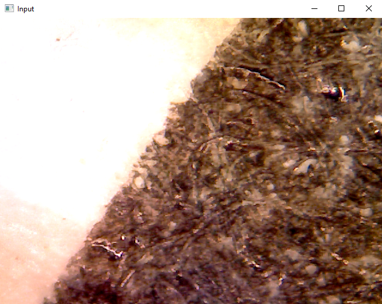

# Low-cost Automated Microscope

### Introduction

This project is focused on automating a microscope for as little new cost as possible. I will continue to expand on this as I have free time, and will either post or link to publications/presentations that I generate alongside this project. 

As I happen to have a metallurgical/metallographic microscope on-hand, I am automating it. The lamp has burned out and will need replacing, but the optical train and controls are in more than acceptable shape. 

### List of Materials/Links

Some of the items (stepper motors & stepper motor driver boards) I had from previous projects, so I have linked what appear to be equivalent products to what I have. For these, I would still read reviews to ensure the actual product is quality. If the links are broken I added the name you would have to search to find an equivalent. You can also shop around to find better prices not on Amazon. Of course you may be able to find cheaper alternatives by buying secondhand or recycling DC motors from appliances or other electronics, but this project uses new components to be more accessible. 

|Component|Cost|Item|Link|
|---------|----|----|----|
|Microscope|N/A|Meiji Metallurgical Microscope| |
|Camera|$48.99|Swift 1.3MP USB Microscope Camera|[Amazon](https://www.amazon.com/Megapixel-Microscopes-Connection-Photography-Compatible/dp/B07P9B6ZGR/ref=asc_df_B07P9B6ZGR/?tag=hyprod-20&linkCode=df0&hvadid=459655373910&hvpos=&hvnetw=g&hvrand=94904027623312667&hvpone=&hvptwo=&hvqmt=&hvdev=c&hvdvcmdl=&hvlocint=&hvlocphy=1025001&hvtargid=pla-944947222765&psc=1&mcid=f9ae823ee97e3f3db9a01c8cab53ac08&gclid=EAIaIQobChMI7b7li_LWhAMV02tHAR2vvgLUEAQYASABEgKIwPD_BwE)|
|Stepper Motors|3x $8.33|NEMA17 Stepper Motors|[Similar to this @Amazon](https://www.amazon.com/gp/aw/d/B0817T5SRH/?_encoding=UTF8&pd_rd_plhdr=t&aaxitk=9733b4431d1f448fafcb45809b51e88a&hsa_cr_id=9897618960401&qid=1709444819&sr=1-1-9e67e56a-6f64-441f-a281-df67fc737124&ref_=sbx_be_s_sparkle_mcd_asin_0_img&pd_rd_w=vpl3p&content-id=amzn1.sym.417820b0-80f2-4084-adb3-fb612550f30b%3Aamzn1.sym.417820b0-80f2-4084-adb3-fb612550f30b&pf_rd_p=417820b0-80f2-4084-adb3-fb612550f30b&pf_rd_r=DP41PE3ABQ60QT70XBEC&pd_rd_wg=yfoZg&pd_rd_r=efd6cb77-3593-496b-b120-75a8f8d525e9&th=1)|
|Stepper Driver Board|3x $2.50|L298N|[Similar to this @Amazon](https://www.amazon.com/Controller-H-Bridge-Stepper-Control-Mega2560/dp/B07WS89781/ref=asc_df_B07WS89781/?tag=&linkCode=df0&hvadid=385215532707&hvpos=&hvnetw=g&hvrand=14777149441366171360&hvpone=&hvptwo=&hvqmt=&hvdev=c&hvdvcmdl=&hvlocint=&hvlocphy=1025001&hvtargid=pla-881401609127&mcid=1ca5842263893f18abb2c42a5e89abd7&ref=&adgrpid=73789134890&gclid=EAIaIQobChMI9-ST8bHXhAMVl0RHAR2B6gTvEAQYASABEgLd_fD_BwE&th=1)|
|MC| | | |
|BQ|$52.99|||
|**Total Cost**|**$134.47**|||

If you currently lack a microscope, several K12-grade options exist on Amazon between $100-$200USD. These microscopes don't have high quality optics and you may encounter more aberrations/artefacts in use, but automation has the potential to increase the quality through a variety of methods. A metallurgical/metallographic microscope will typically have incident light from a lamp with a beamsplitter, while biological microscopes found for cheap on Amazon will have transmitted light from below. I'm sure you could find one for less than $200 that would be completely acceptable. If that is too much still, you could frequent local secondhand shops if any exist in your area, or look for used lab equipment from online vendors such as Amscope, Ebay, or LabX. Be warned: there are plenty of expensive options on those sites as well. 

I don't have a breadth of experience testing all the individual components and other options that are out there so the products selected are ones I chose from reading reviews and tech sheets. The Swift 1.3MP USB camera seemed appropriate from the Amazon reviews. It came with a Driver/Software disc but was not used. If you want to experiment with their camera software, it can be downloaded from their Swift EP Microscope Camera site. Instead, I use it as a webcam and there shouldn't be a need for a driver beyond the conventional USB Camera driver (at least for Windows). See below for the first image obtained using OpenCV to output the Swift camera feed to the computer.

